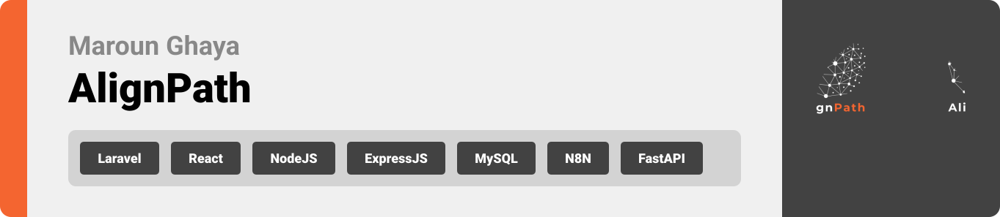
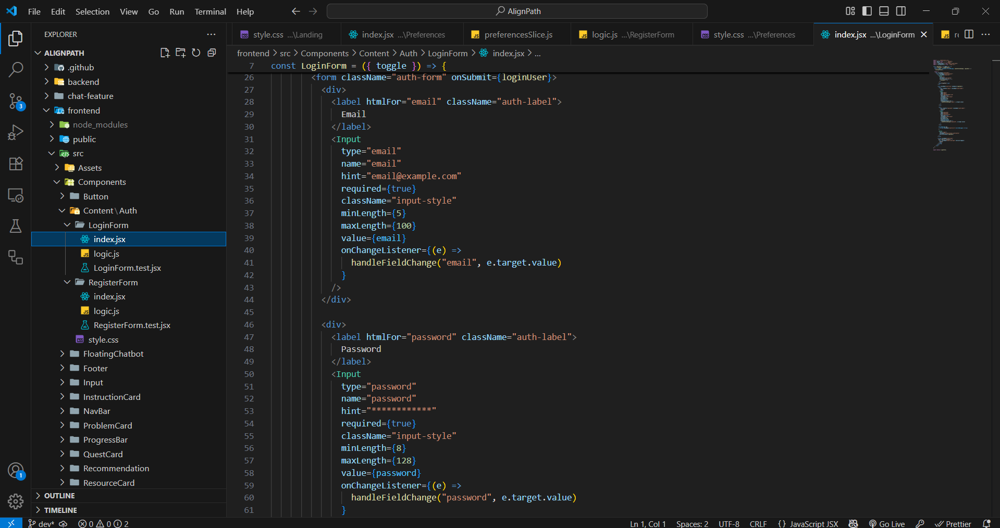

  

<!-- project overview -->

> AlignPath aims to help every student discover a career that truly aligns with their passions, strengths, and aspirations.
> The mission is to guide them toward a future where they enter the professional world with confidence, purpose, and enthusiasm.

  

<!-- System Design -->

### System Architecture

### ER Diagram

  

<!-- Project Highlights -->

### AlignPath main features

- Personalized Career Recommendations:
  Analyzes students' preferences to suggest tailored career paths and to generate quests, problems and skills that best fit their unique profiles with an AI chatbot to elaborate more on the saved careers.

- Chatting feature with speech-to-text:
  Allows students to start conversations with mentors and vice-versa with an option to record a voice and auto transcribe it to text to facilitates communication.

- Automated Workflow:
  Collects chats between users and the AI-chatbot and provides a summary about each chat to assess the chatbot responses and users intentions while using the chatbot.
    

<!-- Demo -->

### Users Screens

| Login screen                   | Register screen                       |
| ------------------------------ | ------------------------------------- |
|  |  |

  

<!-- Development & Testing -->

### Separation of concerns, Input validation, test cases

| Services                                                                                   | Validation                                                                                   | Testing                                                                          |
| ------------------------------------------------------------------------------------------ | -------------------------------------------------------------------------------------------- | -------------------------------------------------------------------------------- |
|   |   |   |

  

<!-- Deployment -->

### Add Title Here

- Description here.

| Postman API 1                           | Postman API 2                         | Postman API 3                         |
| --------------------------------------- | ------------------------------------- | ------------------------------------- |
|  |  |  |

  
