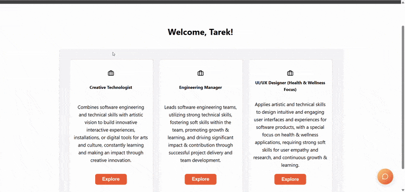
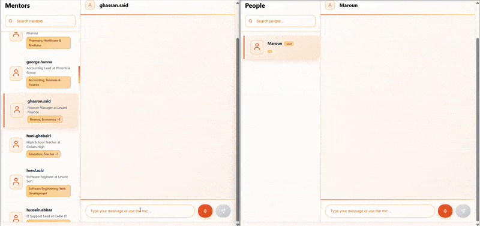
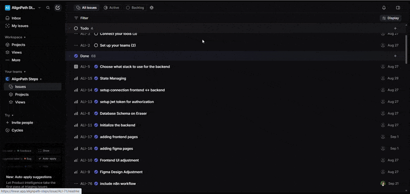
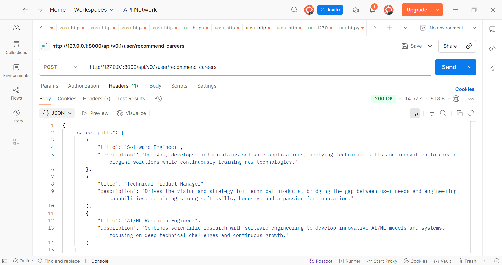

  

<!-- project overview -->

> AlignPath aims to help every student discover a career that truly aligns with their passions, strengths, and aspirations.
> The mission is to guide them toward a future where they enter the professional world with confidence, purpose, and enthusiasm.

  

<!-- System Design -->

### System Architecture

### ER Diagram

- Link to eraser (https://app.eraser.io/workspace/2edjoRzOZ3BAU3XtT2s1?origin=share)
- 

  

<!-- Project Highlights -->

### AlignPath main features

- Personalized Career Recommendations:
  Analyzes students' preferences to suggest tailored career paths and to generate quests, problems and skills that best fit their unique profiles with an AI chatbot to elaborate more on the saved careers.

- Chatting feature with speech-to-text:
  Allows students to start conversations with mentors and vice-versa with an option to record a voice and auto transcribe it to text to facilitates communication.

- Automated Workflow:
  Collects chats between users and the AI-chatbot and provides a summary about each chat to assess the chatbot responses and users intentions while using the chatbot.
    

<!-- Demo -->

### Users Screens

| Get Recommendations                                   | Save Path                                   |
| ----------------------------------------------------- | ------------------------------------------- |
|  |  |

| Quests & Problems                                         | AI-Chatbot                            |
| --------------------------------------------------------- | ------------------------------------- |
|  |  |

| Live Chatting                            | Speech to Text                                  |
| ---------------------------------------- | ----------------------------------------------- |
|  |  |

### Admin Screen

| Admin Dashboard                                |
| ---------------------------------------------- |
|  |

  

### Linear

- Ticketing system linked with github (commits include ticket id referring to the task)

| Issues in Linear                    |
| ----------------------------------- |
|  |

  

### Future Work

- Develop a Communities feature to group users with similar saved fields, enabling them to exchange knowledge, experiences, and resources.

- Introduce a Points & Rewards System where users earn points for contributions (e.g., solving quests, problems ...) and redeem them for perks such as leveling, premium features and certifications.

  

<!-- Development & Testing -->

### Functionality & Reliability

- Used for the frontend tests: jest(testing library) & for the backend Laravel TestCase
- Commands: npm test (frontend) & php artisan test (backend)

| Services                                                                                                  | Validation                                                                                                            | Testing                                                                                       |
| --------------------------------------------------------------------------------------------------------- | --------------------------------------------------------------------------------------------------------------------- | --------------------------------------------------------------------------------------------- |
|   |   |   |

  

<!-- Deployment -->

### API Testing with Postman

- Screenshots of Postman tests for the core APIs: Login, Career Recommendation, and Get Saved Paths.

| Postman API 1                          | Postman API 2                          | Postman API 3                          |
| -------------------------------------- | -------------------------------------- | -------------------------------------- |
|  |  |  |

  

### Swagger

- To access the Swagger UI hit this endpoint: http://localhost:8000/api/documentation

| APIs Documentation                    |
| ------------------------------------- |
|  |
